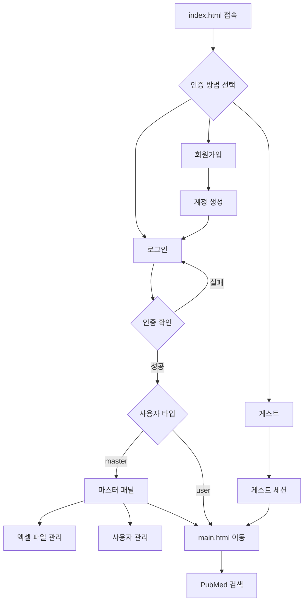

# 🔐 PubMed 검색 도구 - 로그인 시스템 사용 가이드

## 📋 개요

PubMed 검색 도구에 완전한 로그인 시스템이 추가되었습니다. **엑셀 파일 기반** 사용자 관리, 인증, 권한 제어 기능을 제공합니다.

## 🚀 시작하기

### 1. 접속 방법
1. `index.html` 페이지로 접속 (로그인 페이지)
2. 로그인, 회원가입, 또는 게스트 모드 선택
3. 인증 완료 후 `main.html`로 자동 이동

### 2. 접속 옵션

#### 🔑 마스터 로그인
- **ID**: `master`
- **Password**: `master`
- **권한**: 모든 사용자 데이터 관리, Excel 다운로드/업로드

#### 👤 일반 사용자 로그인
- 회원가입을 통해 계정 생성
- PubMed 검색 도구의 모든 기능 이용

#### 👥 게스트 모드
- 로그인 없이 즉시 이용
- 모든 검색 기능 사용 가능
- 데이터는 저장되지 않음

## 💾 엑셀 기반 사용자 데이터 관리 

### 🆕 새로운 엑셀 관리 기능

#### 초기 엑셀 파일 생성
1. 마스터로 로그인 (master/master)
2. "초기 엑셀 파일 생성" 버튼 클릭
3. 샘플 사용자들이 포함된 엑셀 파일 자동 다운로드

#### 엑셀에서 사용자 로드
1. 마스터 패널에서 "엑셀에서 사용자 로드" 버튼 클릭
2. 준비된 엑셀 파일 선택
3. 시스템이 자동으로 사용자 데이터를 로드

### Excel 파일 구조
```
사용자ID | 이름 | 이메일 | 권한 | 생성일 | 비밀번호
master  | Master Admin | master@acuzenic.com | master | 2025-08-23 | master
admin   | 관리자 | admin@acuzenic.com | user | 2025-08-23 | admin123
user1   | 사용자1 | user1@acuzenic.com | user | 2025-08-23 | user123
researcher | 연구원 | researcher@acuzenic.com | user | 2025-08-23 | research123
```

### 지원되는 권한
- **master**: 전체 관리 권한
- **user**: 일반 사용자
- **guest**: 게스트 (임시)

## 🔧 마스터 관리 기능

### 📊 초기 엑셀 파일 생성
1. 마스터로 로그인 (master/master)
2. "초기 엑셀 파일 생성" 버튼 클릭
3. 기본 사용자들이 포함된 엑셀 파일 자동 다운로드
4. 생성된 파일을 편집하여 사용자 추가/수정

### 📤 엑셀에서 사용자 로드
1. "엑셀에서 사용자 로드" 버튼 클릭
2. 준비된 엑셀 파일 선택 
3. 시스템이 파일을 읽어 모든 사용자 데이터 로드
4. 기존 데이터는 완전히 대체됨

### 💾 현재 사용자 다운로드
1. "현재 사용자 다운로드" 버튼 클릭
2. 현재 시스템의 모든 사용자 정보를 엑셀로 다운로드
3. 백업 및 편집 목적

### 사용자 삭제
- 마스터 패널에서 개별 사용자 삭제 가능
- 마스터 계정은 삭제 불가

## 🛡️ 보안 특징

### 데이터 저장
- **LocalStorage**: 사용자 데이터베이스
- **SessionStorage**: 로그인 세션
- **클라이언트 사이드**: 모든 데이터는 브라우저에 저장

### 보안 제한사항
⚠️ **중요**: 이 시스템은 교육/데모 목적으로 설계되었습니다.
- 비밀번호는 암호화되지 않음
- 실제 서비스에서는 서버사이드 인증 필요

## 📱 사용자 인터페이스

### 로그인 페이지 (`index.html`)
- 로그인 폼
- 회원가입 폼
- 게스트 입장 버튼
- 마스터 관리 패널 (마스터 로그인 시)
- **엑셀 파일 관리 기능** (NEW!)

### 메인 페이지 (`main.html`)
- 헤더에 사용자 정보 표시
- 로그아웃 버튼
- 기존 PubMed 검색 기능 유지

## 🔄 워크플로우



## 📁 파일 구조

```
PubMed/
├── index.html              # 로그인 페이지 (변경됨)
├── main.html               # 메인 페이지 (변경됨)
├── login.html              # 기존 로그인 파일 (백업용)
├── css/
│   ├── style.css          # 기존 스타일
│   └── login.css          # 로그인 페이지 스타일
├── js/
│   ├── auth.js            # 인증 로직 (엑셀 기능 추가)
│   ├── main-auth.js       # 메인 페이지 인증
│   ├── init-users.js      # 초기 데이터 생성
│   ├── config.js          # 설정
│   └── script.js          # 기존 PubMed 기능
└── README-LOGIN.md         # 이 파일
```

## ⚙️ 설정 및 커스터마이징

### 📊 엑셀 기반 사용자 관리 워크플로우
1. 마스터로 로그인 후 "초기 엑셀 파일 생성" 실행
2. 다운로드된 엑셀 파일을 편집하여 사용자 추가/수정
3. "엑셀에서 사용자 로드" 버튼으로 파일 업로드
4. 시스템이 자동으로 모든 사용자 데이터를 로드

### UI 커스터마이징
- `css/login.css`: 로그인 페이지 스타일
- `js/main-auth.js`: 메인 페이지 사용자 표시

### 권한 시스템 확장
```javascript
// auth.js에서 권한 체크
function hasPermission(user, action) {
  switch(user.role) {
    case 'master': return true;
    case 'admin': return action !== 'delete_user';
    case 'user': return action === 'search';
    default: return false;
  }
}
```

## 🐛 문제 해결

### 일반적인 문제

1. **로그인 실패**
   - 브라우저 개발자 도구 Console 확인
   - LocalStorage 데이터 확인

2. **사용자 데이터 손실**
   - LocalStorage 용량 제한 (5-10MB)
   - 브라우저 데이터 삭제 시 초기화

3. **Excel 업로드 실패**
   - 파일 형식 확인 (.xlsx, .xls)
   - 컬럼 헤더 정확성 확인

### 데이터 백업/복원
```javascript
// 백업
const backup = localStorage.getItem('userDatabase');
console.log(backup);

// 복원
localStorage.setItem('userDatabase', backup);
```

## ✨ 새로운 기능 (v2.0)

### 🎉 완료된 기능
- [x] **엑셀 기반 사용자 관리**: 초기 파일 생성, 로드, 다운로드
- [x] **파일 구조 재조직**: index.html → 로그인, main.html → 메인
- [x] **마스터 패널 개선**: 직관적인 엑셀 파일 관리
- [x] **자동 리다이렉션**: 로그인 후 자동으로 메인 페이지 이동

### 🔮 향후 개선 계획 (v3.0)
- [ ] 비밀번호 암호화
- [ ] 이메일 인증
- [ ] 역할 기반 접근 제어 (RBAC)
- [ ] 검색 히스토리 저장
- [ ] 사용자별 즐겨찾기

### 서버사이드 연동 (옵션)
- [ ] JWT 토큰 인증
- [ ] 데이터베이스 연동
- [ ] API 인증

## 📞 지원

문제가 발생하거나 기능 요청이 있으시면:
1. 브라우저 개발자 도구 확인
2. LocalStorage/SessionStorage 상태 점검
3. GitHub Issues 등록

---

## 🚀 업그레이드 완료!

✨ **엑셀 기반 사용자 관리 시스템으로 업그레이드된 PubMed 검색 도구**

### 🎯 핵심 개선사항
1. **🏠 시작 페이지**: `index.html`로 바로 로그인
2. **📊 엑셀 관리**: 사용자 데이터를 엑셀 파일로 완전 관리
3. **🔄 간편한 워크플로우**: 파일 생성 → 편집 → 로드
4. **🛡️ 마스터 관리**: 직관적인 관리자 패널

🎉 **안전하고 편리한 PubMed 검색을 즐기세요!**
